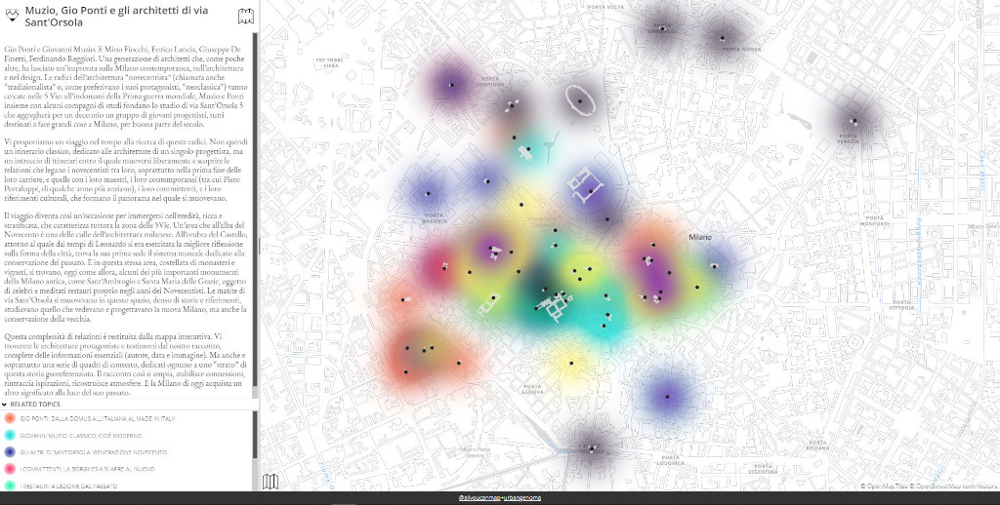
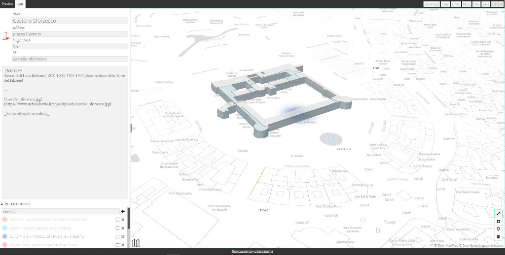

# UG Map

This repository is a refactor from scratch of an old projects I worked on.

This js application allows to view and edit connections between topics and features on a map.

Preview of view mode:


Preview of edit mode:


## Content structure and configuration

This application works with a GeoJSON file with extended properties to render features on the map and connect them with topics, this is the basic structure of the ug-map content:

```js
{
    "type": "FeatureCollection",
    "properties": {
        "iconSrc": "arch5v",
        "title": { "_": "Empty" },
        "content": { "_": "" }
    },
    "topics": [],
    "features": []
}
```

There are also additional configurations to customize the final visualization:

- `config.json` additional configuration to enrich the map view
    - `config.credits` an html string to use in the footer as credits for the content
    - `config.languages` list of languages object eg: [{ id: '_', label: 'Default' }, { id: 'en', label: 'English' }]
    - `map.center` initial center of the map [lng, lat]
    - `map.zoom` initial zoom of the map
    - `map.polygonStyle` override style of polygon features
    - `map.lineStyle` override style of line features
    - `map.lineSelectedStyle` override style of selected line features
    - `map.markerStyle` override style of point features
    - `map.markerSelectedStyle` override style of selected point features
    - `map.style` a valid mapbox style configuration to use as background (version 8 supported by maplibre-gl or mapbox-gl < 2.0)

- `icons.json` the list of icons available

The app functionality can be enabled in two ways:

- via query parameters:
    - `lang` initial selected language http://localhost:8080/?lang=en (the language must be listed in the available languages)
    - `id` id of selected ug-map, eg: http://localhost:8080/?id=example.json (note: the json file must be in the static/data/ directory for this configuration)
    - `edit` if true enable edit mode, eg: http://localhost:8080/?edit=true

- via window._UG_CONFIG object
    - `_UG_CONFIG.id` id of selected ug-map
    - `_UG_CONFIG.api` override the api implementation to interact with a backend
    - `_UG_CONFIG.edit` if true enable edit mode
    - `_UG_CONFIG.rootPath` location of the ug-map application
    - `_UG_CONFIG.collection` ug-map feature collection object
    - `_UG_CONFIG.config` config json

Note: the application has not a backend so it will store by default the current improvement in the localStorage of the browser
so you need to download manually the created ug-map and upload it in the static/data folder to save the improvements.

## Development

- `yarn install`

- `yarn start`

## Build

- `yarn build`
